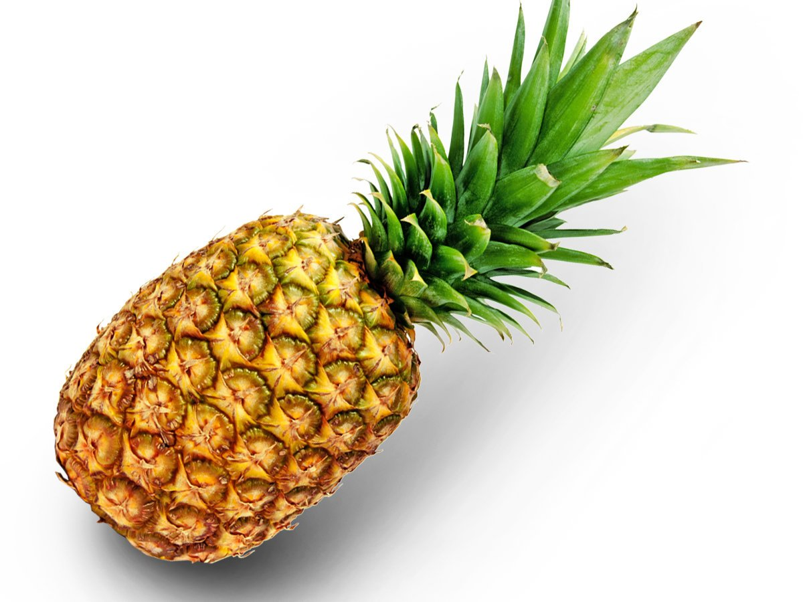
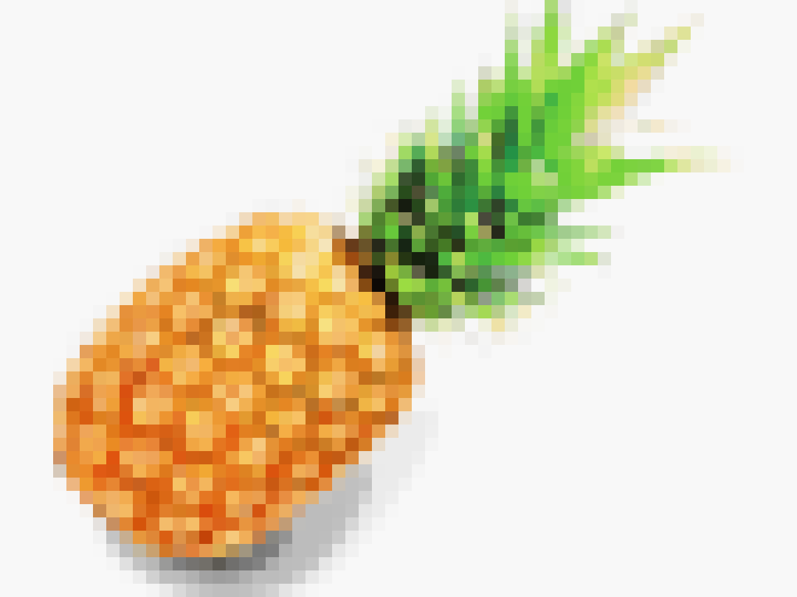
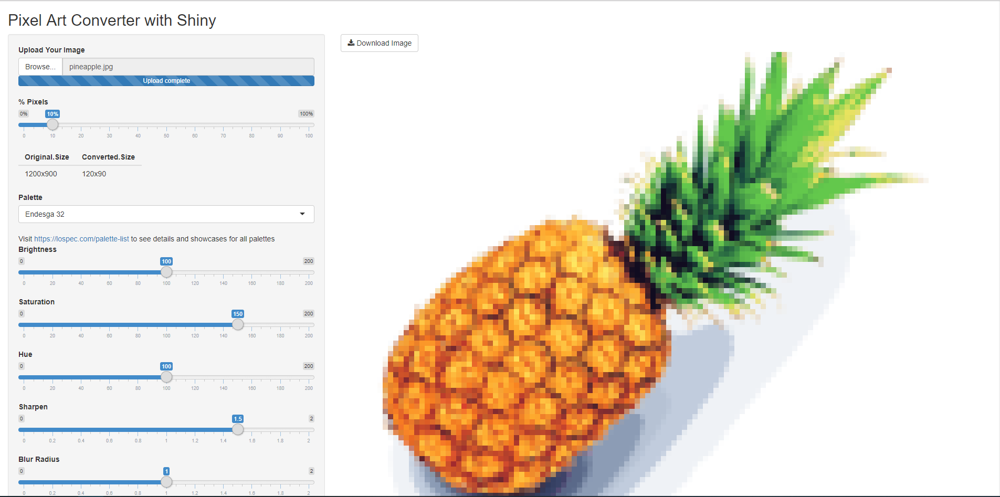

# Make Pixel Art with R Shiny!

This app makes use of `magick` library to convert any images into pixel art. 

Demo available at  https://yifyan-yusuzech.shinyapps.io/pixcel_art_converter_shiny/ .

#### Convert a Pineapple to a Pixel Pineapple!

#### App

Decide your configuration and start making pixel art.  
Besides adjusting saturation,brightness, etc. There are also more than [200 palettes](https://lospec.com/palette-list) to choose from.

